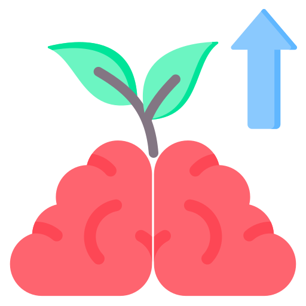
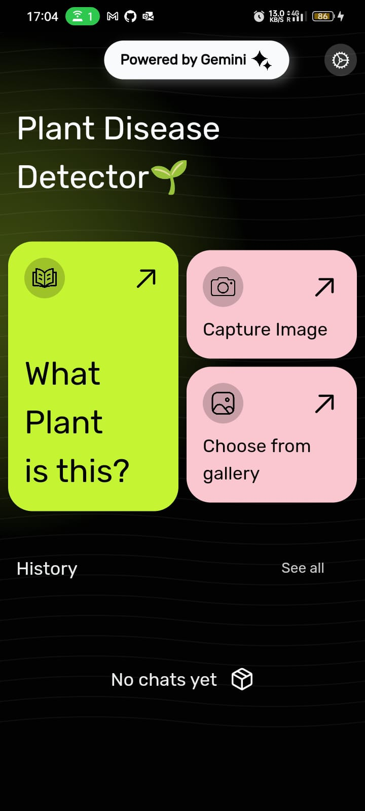
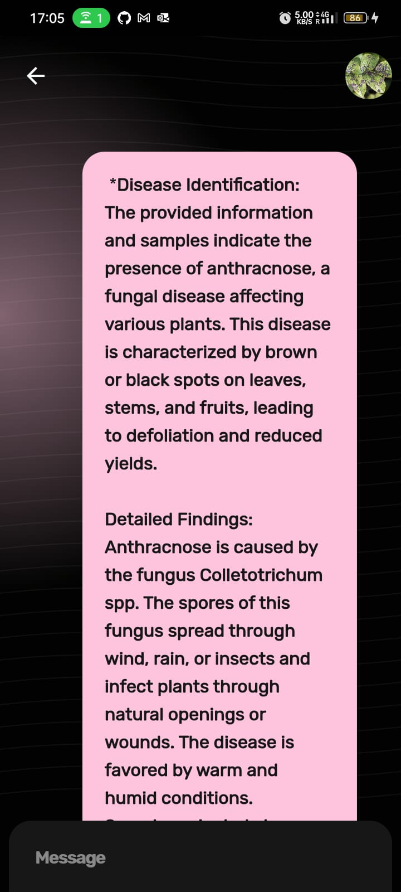
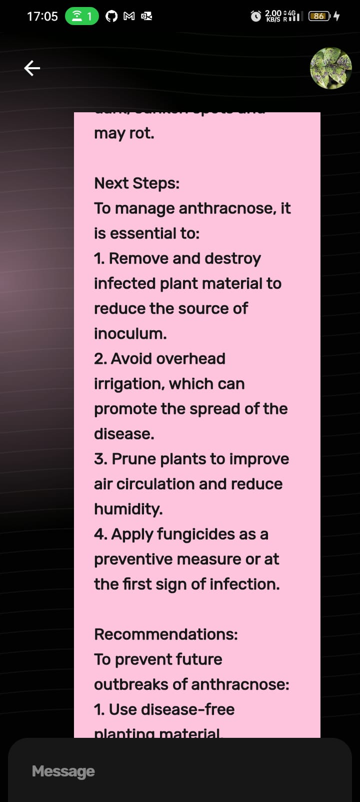

# Flora Snap

Welcome to the Flora Snap ~ A Plant Disease Detection App! This Flutter application helps farmers and gardeners diagnose plant diseases by analyzing images of their plants and providing relevant information and recommendations using the Google Gemini API.

## Features

1. **Image Capture**: Users can take pictures of their plants or upload images from their device's gallery.
2. **Query-Based Diagnosis**: Users can ask queries regarding the health of their plants by typing text descriptions or questions.
3. **Chat History**: View the history of previous chats and interactions with the app.
4. **Automatic Disease Detection**: Automatically detect plant diseases from uploaded images using the Google Gemini API.
5. **Personalized Recommendations**: Receive personalized recommendations for plant care and disease management.

## Screenshots

  
  
  

## Getting Started

To get started with Flora Snap App, follow these steps:

1. Clone the repository:

``
git clone https://github.com/your_username/plant-disease-detection.git
``

2. Install dependencies:

``
cd plant-disease-detection
flutter pub get
``

3. Run the application:

``
flutter run
``

## Usage

1. Capture or upload an image of your plant.
2. Ask queries or describe any concerns regarding the health of your plant.
3. Receive feedback, disease diagnoses, and recommendations from the app.
4. View the history of previous chats and interactions.

## Contributing

Contributions are welcome! If you have any suggestions, bug fixes, or new features to propose, please open an issue or submit a pull request.

## License

This project is licensed under the MIT License - see the [LICENSE](LICENSE) file for details.

## Acknowledgments

- Special thanks to Google for providing the Gemini API for image analysis.
- This project was inspired by the need to assist farmers and gardeners in diagnosing plant diseases and promoting sustainable agriculture.

